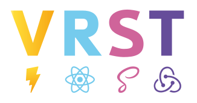
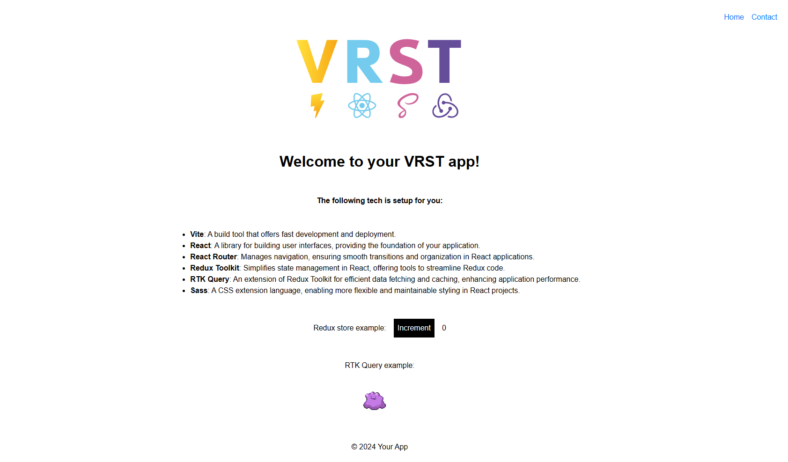
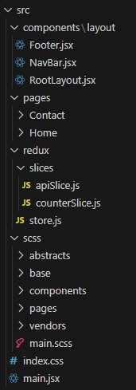
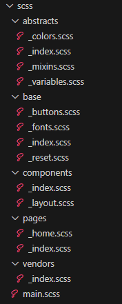

#  VRST - A template for scalable React applications

This template provides (possibly) everything you need to kickstart your scalable React application. A unit testing library is not included to account for smaller sized projects. I've been using this setup for my personal projects and will continue to do so. I figured I could just as well share this in case someone finds it usefull. I've found that this setup offers me a lot of flexibility and keeps things relatively simple. 

#### The following tech is setup for you:
1. **Vite 5.1.4**: A build tool that offers fast development and deployment.
2. **React 18.2.0**: A library for building user interfaces, providing the foundation of your application.
3. **React Router 6.22.2**: Manages navigation, ensuring smooth transitions and organization in React applications.
4. **Redux Toolkit 2.2.1**: Simplifies state management in React, offering tools to streamline Redux code.
5. **RTK Query**: An extension of Redux Toolkit for efficient data fetching and caching, enhancing application performance.
6. **Sass 1.71.1**: A CSS extension language, enabling more flexible and maintainable styling in React projects.

 

#### Additional setup
1. A basic folder structure.
  For SCSS/SASS a somewhat simplified derivative of the 7-1 structure.

&nbsp;&nbsp;&nbsp;&nbsp;&nbsp;&nbsp;&nbsp;&nbsp;&nbsp;&nbsp;

2. A basic SCSS Reset.

3. For quick reference: 
    1. An incrementing counter is present to showcase Redux Toolkit
    2. A Ditto fetched from the PokéAPI to showcase RTK-Query.
    3. A Home and Contact page configured through React Router
    4. A RootLayout, NavBar & Footer component.

## How to run
1. npm install
2. npm run dev
    

### **Happy coding!**

